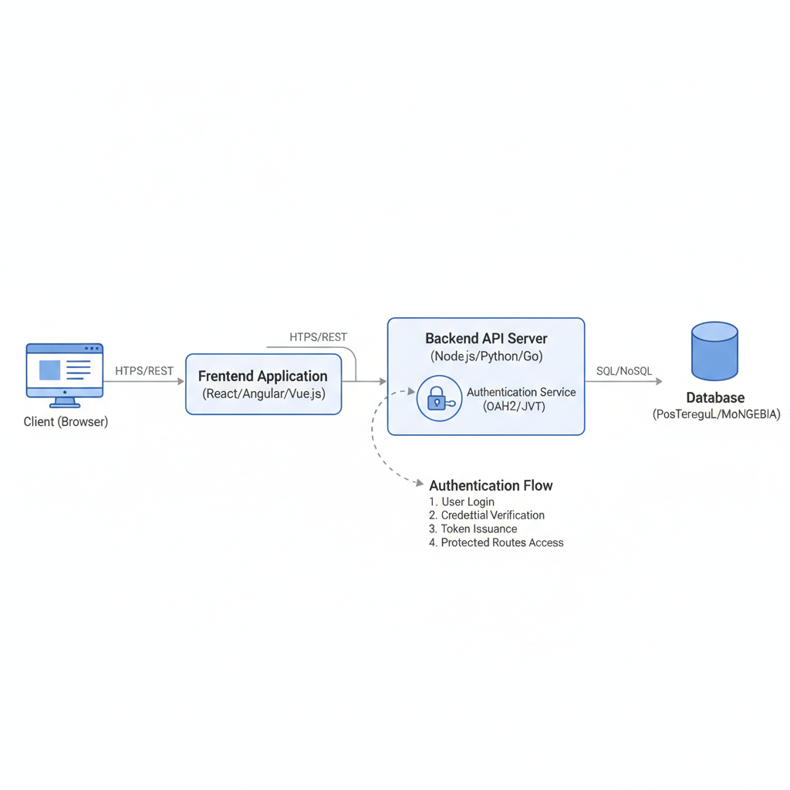
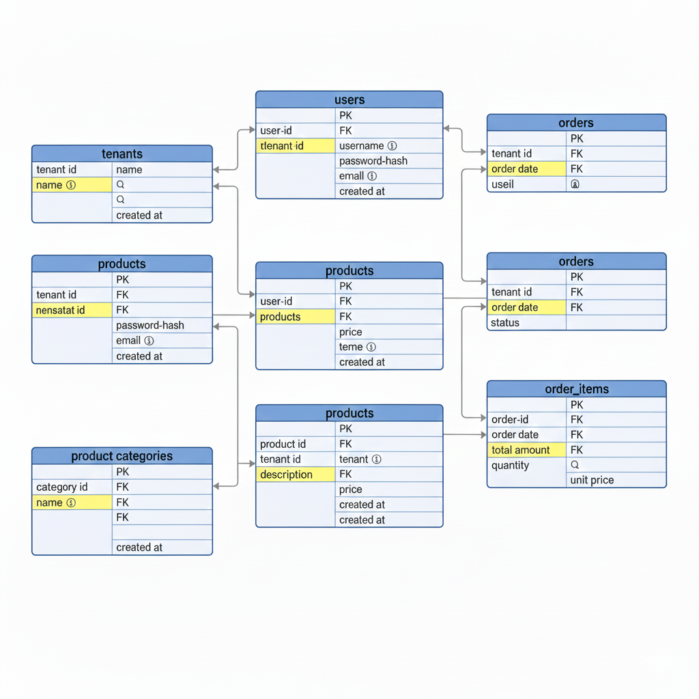

## System Architecture Diagram

## Database Schema Design

---

## API Architecture

The system follows a RESTful API architecture where endpoints are grouped by functionality. All protected APIs enforce authentication and role-based authorization to ensure tenant isolation and secure access.

---

### Auth APIs

* **POST /auth/register** (Public)
  Registers a new user.

* **POST /auth/login** (Public)
  Authenticates a user and returns a JWT.

* **POST /auth/logout** 🔐
  Logs out the authenticated user.

* **POST /auth/forgot-password** (Public)
  Initiates password reset flow.

* **POST /auth/reset-password** (Public)
  Resets user password using a secure token.

---

### Tenant APIs

* **POST /tenants** 🔐 👑 *Super Admin*
  Creates a new tenant.

* **GET /tenants** 🔐 👑 *Super Admin*
  Retrieves all tenants.

* **GET /tenants/:id** 🔐 👑 *Super Admin*
  Retrieves details of a specific tenant.

* **PUT /tenants/:id** 🔐 👑 *Super Admin*
  Updates tenant information.

* **DELETE /tenants/:id** 🔐 👑 *Super Admin*
  Deactivates a tenant.

---

### User APIs

* **POST /users** 🔐 👑 *Tenant Admin*
  Creates a new user within the tenant.

* **GET /users** 🔐 👑 *Tenant Admin*
  Retrieves all users in the tenant.

* **GET /users/:id** 🔐
  Retrieves user details.

* **PUT /users/:id** 🔐 👑 *Tenant Admin*
  Updates user role or information.

* **DELETE /users/:id** 🔐 👑 *Tenant Admin*
  Deactivates a user account.

---

### Project APIs

* **POST /projects** 🔐
  Creates a new project within the tenant.

* **GET /projects** 🔐
  Retrieves all projects for the tenant.

* **GET /projects/:id** 🔐
  Retrieves project details.

* **PUT /projects/:id** 🔐
  Updates project information.

* **DELETE /projects/:id** 🔐
  Deletes a project.

---

### Task APIs

* **POST /tasks** 🔐
  Creates a new task under a project.

* **GET /tasks** 🔐
  Retrieves all tasks for a project.

* **GET /tasks/:id** 🔐
  Retrieves task details.

* **PUT /tasks/:id** 🔐
  Updates task status or information.

* **DELETE /tasks/:id** 🔐
  Deletes a task.

---

### Notes

* 🔐 **Authentication** is enforced using JWT for all protected endpoints
* 👑 **Role-based authorization** ensures only permitted roles can access sensitive APIs
* Tenant context is validated for every authenticated request to prevent cross-tenant access

